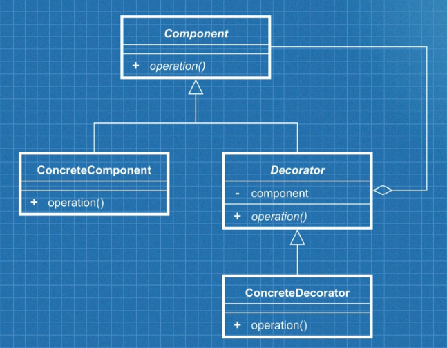

## Decorator Pattern
- Diagram

- Explain: 
    - `Component` is `Car` class
    - `ConcreteComponent` are `ModelS`, `ModelX`
    - `Decorator` is `CarOptions`
    - `ConcreteDecorator` is `EnhancedAutoPilot`, `RearFacingSeats`